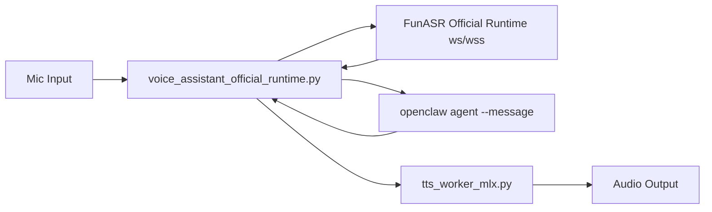

# voice-mode-manager

让 OpenClaw 具备本地实时语音对话能力（官方 ASR runtime + 本地 TTS worker），并以 **Skill 形式**统一启停与健康检查。

## 1. 这是什么

`voice-mode-manager` 是一个可移植的 OpenClaw Skill，负责管理一条常驻语音链路：

1. 麦克风实时采集音频。
2. 发送到 FunASR 官方 runtime（2pass）进行在线/离线识别。
3. 将离线稳定文本交给 OpenClaw agent 推理。
4. 使用 MLX TTS worker 合成语音并播放。

这个仓库只做“管理与编排”，不修改 OpenClaw core。

## 2. 核心能力

- 一键启动/停止/状态检查：`voice_mode_start.sh` / `voice_mode_stop.sh` / `voice_mode_status.sh`
- 官方 ASR 链路优先：要求存在 Docker 容器 `funasr-official`
- 启动健康检查：进程存活、TTS worker socket、ASR websocket 探针
- 结构化日志：每轮输出 `asr_ms/llm_ms/tts_ms/e2e_ms`
- 语音打断（barge-in）：新的语音可中断上一条播放
- 去硬编码路径：支持跨机器部署（通过环境变量或相对路径自动解析）

## 3. 架构流程



## 4. 目录说明

- [SKILL.md](./SKILL.md): Skill 入口说明（给 Codex/OpenClaw）
- [scripts/voice_mode_start.sh](./scripts/voice_mode_start.sh): 启动流程（含健康检查）
- [scripts/voice_mode_stop.sh](./scripts/voice_mode_stop.sh): 停止流程
- [scripts/voice_mode_status.sh](./scripts/voice_mode_status.sh): 状态查看
- [runtime/voice-gateway/voice_assistant_official_runtime.py](./runtime/voice-gateway/voice_assistant_official_runtime.py): 官方 ASR 实时主循环
- [runtime/voice-gateway/tts_worker_mlx.py](./runtime/voice-gateway/tts_worker_mlx.py): 本地 TTS worker
- [runtime/voice-gateway/requirements.txt](./runtime/voice-gateway/requirements.txt): Python 依赖
- [tools/install_skill.sh](./tools/install_skill.sh): 一键安装到 `~/.openclaw`
- [tools/verify_setup.sh](./tools/verify_setup.sh): 环境检查
- [AGENTS.md](./AGENTS.md): 面向 agent 的部署执行手册

## 5. 最低环境要求

### 系统与运行时

- macOS（建议 Apple Silicon）
- Python `>= 3.10`
- Docker `>= 24`
- OpenClaw 已安装且 CLI 可用（`openclaw --version`）

### 必需组件

1. FunASR 官方 runtime（Docker 方式）
2. `funasr-official` 容器名（启动脚本按该名字检查）
3. `voice-gateway/.venv` Python 环境
4. MLX TTS 运行时（`VOICE_MLX_TTS_PY` 指向可用 python）

## 6. 需要下载/准备的开源项目（官方链接）

### 核心项目

- OpenClaw: <https://github.com/openclaw/openclaw>
- FunASR: <https://github.com/modelscope/FunASR>
- FunASR runtime 文档目录: <https://github.com/modelscope/FunASR/tree/main/runtime>
- MLX Audio（`mlx_audio`）: <https://github.com/Blaizzy/mlx-audio>

### 语音模型

- Qwen3 TTS MLX 模型（默认）: <https://huggingface.co/mlx-community/Qwen3-TTS-12Hz-0.6B-CustomVoice-4bit>

## 7. 快速安装

### 7.1 安装 Skill 到本机 OpenClaw

```bash
git clone https://github.com/xingyingyuzhui/voice-mode-manager.git
cd voice-mode-manager
bash ./tools/install_skill.sh
```

### 7.2 校验环境

```bash
bash ./tools/verify_setup.sh
```

### 7.3 启动

```bash
bash ~/.openclaw/workspace/skills/voice-mode-manager/scripts/voice_mode_start.sh
```

### 7.4 查看状态/停止

```bash
bash ~/.openclaw/workspace/skills/voice-mode-manager/scripts/voice_mode_status.sh
bash ~/.openclaw/workspace/skills/voice-mode-manager/scripts/voice_mode_stop.sh
```

## 8. 配置项（最小可用）

### ASR runtime

- `FUNASR_RUNTIME_SCHEME`（默认 `wss`）
- `FUNASR_RUNTIME_HOST`（默认 `127.0.0.1`）
- `FUNASR_RUNTIME_PORT`（默认 `10095`）

### TTS

- `VOICE_TTS_BACKEND`（默认 `mlx`）
- `VOICE_TTS_MLX_MODEL`（默认 Qwen3-TTS MLX 模型）
- `VOICE_TTS_MLX_VOICE`（默认 `Vivian`）
- `VOICE_TTS_MLX_LANG`（默认 `zh`）
- `VOICE_TTS_MLX_TEMPERATURE`（默认 `0.1`）
- `VOICE_TTS_WORKER_SOCK`（默认 `/tmp/voice_tts_worker.sock`）

### LLM 桥接

- `VOICE_LLM_CMD`
  - 默认：`openclaw agent --agent main --message {text}`
  - 必须保留 `{text}` 占位符

### 路径覆盖（可选）

- `VOICE_WORKSPACE` / `OPENCLAW_WORKSPACE`
- `VOICE_GATEWAY_DIR`
- `VOICE_MLX_TTS_PY`
- `VOICE_QWEN_PY`
- `VOICE_QWEN_TTS_SCRIPT`

## 9. 日志与可观测性

### 日志目录

- `~/.openclaw/workspace/voice-gateway/logs/tts_worker.log`
- `~/.openclaw/workspace/voice-gateway/logs/voice_loop_official.log`

### 结构化事件（stdout）

- `voice_connected`
- `voice_asr_online`
- `voice_asr_offline`
- `voice_assistant_reply`
- `voice_turn_metrics`
- `voice_recording`

`voice_turn_metrics` 重点字段：

- `asr_ms`
- `llm_ms`
- `tts_ms`
- `e2e_ms`
- `barge_in_count`
- `reconnect_count`

## 10. 常见问题

### Q1: 启动慢 / 卡在 start

看 `voice_mode_start.sh` 的健康检查：
- `funasr-official` 容器是否可连接
- `VOICE_TTS_WORKER_SOCK` 是否生成
- runtime websocket 是否握手成功

### Q2: 没有声音

- 检查系统输入输出设备
- 设置 `VOICE_INPUT_DEVICE` / `VOICE_OUTPUT_DEVICE`
- 查看 `voice_loop_official.log`

### Q3: TTS 不稳定或失败

- 降低 `VOICE_TTS_MLX_TEMPERATURE`（推荐 `0.0~0.2`）
- 确认 `VOICE_MLX_TTS_PY` 可执行
- 检查模型是否已拉取完成

## 11. 开源依赖与感谢

本项目站在以下开源项目之上。感谢所有维护者和贡献者。

1. OpenClaw（对话 Agent 框架与 CLI）
- 项目地址: <https://github.com/openclaw/openclaw>
- 许可证: Apache-2.0

2. FunASR（实时语音识别链路与 runtime 生态）
- 项目地址: <https://github.com/modelscope/FunASR>
- runtime 文档: <https://github.com/modelscope/FunASR/tree/main/runtime>
- 许可证: MIT

3. MLX Audio（本地 TTS 推理库）
- 项目地址: <https://github.com/Blaizzy/mlx-audio>
- 许可证: Apache-2.0

4. Hugging Face Transformers（Tokenizer/模型加载生态）
- 项目地址: <https://github.com/huggingface/transformers>
- 许可证: Apache-2.0

5. websockets（ASR runtime WebSocket 客户端）
- 项目地址: <https://github.com/python-websockets/websockets>
- 许可证: BSD-3-Clause

6. sounddevice / PortAudio（麦克风采集与音频播放）
- sounddevice: <https://github.com/spatialaudio/python-sounddevice>（MIT）
- PortAudio: <http://www.portaudio.com/>（MIT-like）

7. Qwen3-TTS MLX 社区模型（默认语音模型）
- 模型地址: <https://huggingface.co/mlx-community/Qwen3-TTS-12Hz-0.6B-CustomVoice-4bit>

再次感谢以上项目和社区，让本 Skill 能以较低门槛实现本地实时语音对话。

## 12. 许可证

Apache-2.0，见 [LICENSE](./LICENSE)。
